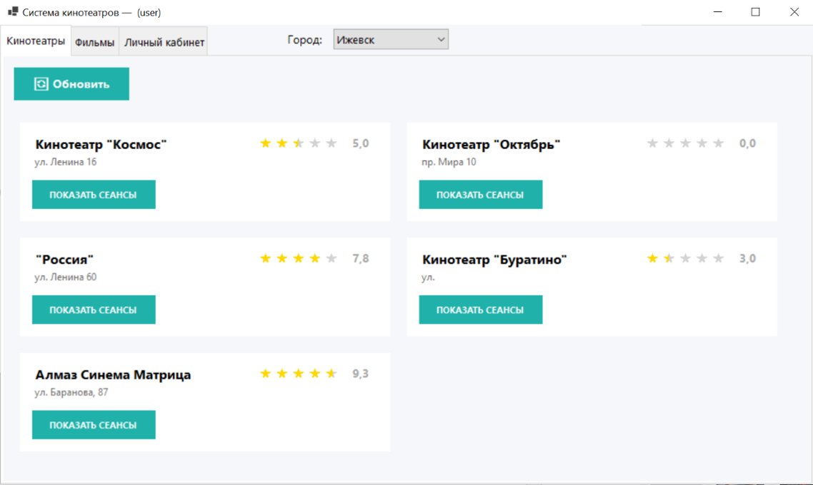
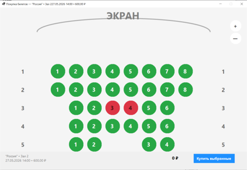
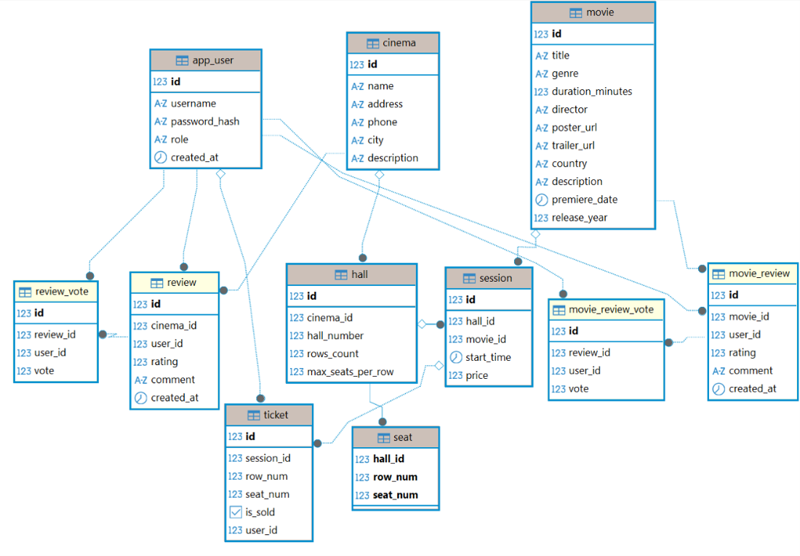

# Cinema Reference System

Система для автоматизации работы справочной службы кинотеатров.

## Возможности

- Авторизация пользователей
- Управление кинотеатрами, залами и фильмами
- Расписание сеансов
- Покупка билетов
- Система отзывов и рейтингов

## Технологии

- C#
- Windows Forms
- PostgreSQL
- Npgsql
- ООП

## Архитектура

- UI
- Application
- Domain
- Infrastructure

## Скриншоты

### Авторизация

### Главное окно

### Покупка билетов

### Схема базы данных

## Документация

Полная пояснительная записка находится в папке `docs`.
