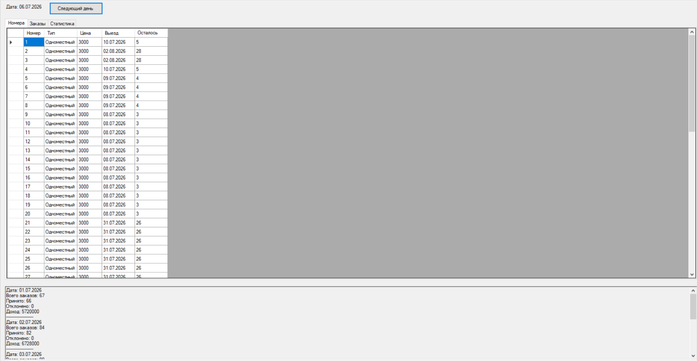
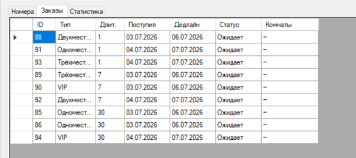
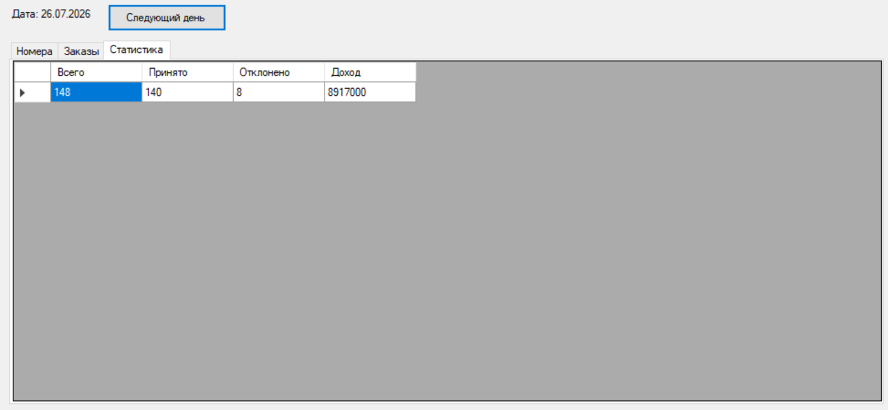

# Hotel Booking

Система моделирования процесса бронирования гостиничных номеров с использованием жадного алгоритма распределения заявок.

## Возможности

- Моделирование работы гостиницы
- Автоматическая генерация заявок
- Распределение заявок по номерам
- Поддержка различных типов номеров
- Использование жадного алгоритма
- Отображение статистики работы системы

## Технологии

- C#
- Windows Forms
- .NET
- ООП

## Архитектура

- Domain
- Business Logic
- UI
- Infrastructure

## Скриншоты

### Главное окно

### Список номеров

### Список заявок

### Статистика

### Диаграмма классов

## Документация

Полный отчет находится в папке `docs`.
